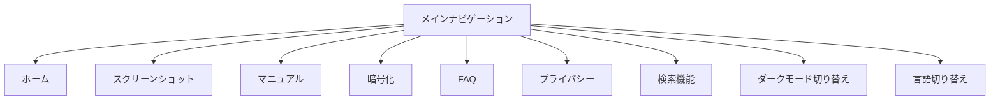
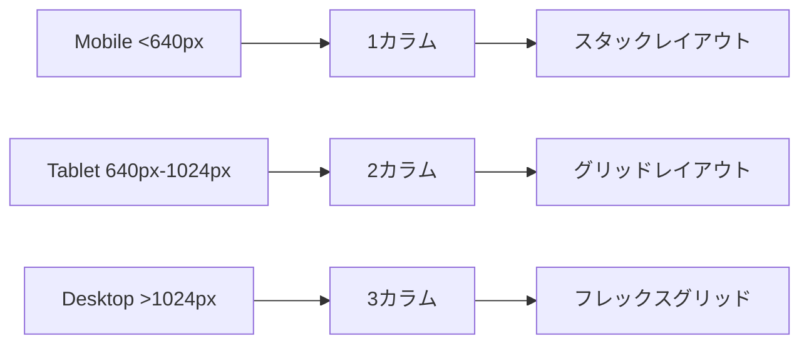

# SkyziBackup Website モダンデザイン仕様書

## 1. デザインコンセプト概要

### 1.1 ビジョン
現在のピンク-ブルーグラデーション（#FF45A3 to #6FCCFF）とテーマカラー（#ABF4FF）を基調として、**グラスモーフィズム**を中心とした2024年トレンドを取り入れたモダンで親しみやすいデザインシステムを構築する。

### 1.2 デザイン哲学
- **信頼性**: 技術的な信頼感を演出する透明度とデプス
- **親しみやすさ**: 初心者〜中級者ユーザーにとって理解しやすいUI
- **モダン性**: グラスモーフィズムを活用した2024年トレンド
- **一貫性**: 全ページで統一されたデザインシステム

### 1.3 ターゲットユーザー
- **プライマリ**: PC利用の初心者〜中級者（ファイルバックアップソフトを探しているユーザー）
- **セカンダリ**: 技術者・開発者（オープンソースソフトウェアに関心のあるユーザー）

## 2. 拡張カラーパレット

### 2.1 プライマリカラー（現在のカラーを基調）
```css
/* メインブランドカラー */
--primary-gradient: linear-gradient(60deg, #FF45A3, #6FCCFF);
--theme-color: #ABF4FF;

/* プライマリカラーバリエーション */
--primary-pink: #FF45A3;
--primary-pink-light: #FF6BB3;
--primary-pink-dark: #E63493;

--primary-blue: #6FCCFF;
--primary-blue-light: #85D4FF;
--primary-blue-dark: #59BAEF;

--theme-light: #C4F7FF;
--theme-dark: #92E1EE;
```

### 2.2 セカンダリカラー（グラスモーフィズム対応）
```css
/* グラスモーフィズム用 */
--glass-white: rgba(255, 255, 255, 0.25);
--glass-white-light: rgba(255, 255, 255, 0.15);
--glass-white-strong: rgba(255, 255, 255, 0.35);

--glass-dark: rgba(0, 0, 0, 0.1);
--glass-dark-light: rgba(0, 0, 0, 0.05);
--glass-dark-strong: rgba(0, 0, 0, 0.2);

/* ボーダー・シャドウ */
--glass-border: rgba(255, 255, 255, 0.2);
--glass-shadow: 0 8px 32px rgba(31, 38, 135, 0.37);
--glass-shadow-light: 0 4px 16px rgba(31, 38, 135, 0.25);
```

### 2.3 セマンティックカラー
```css
/* フィードバックカラー */
--success: #10B981;
--success-light: #34D399;
--warning: #F59E0B;
--warning-light: #FBBF24;
--error: #EF4444;
--error-light: #F87171;
--info: var(--theme-color);

/* ニュートラルカラー */
--neutral-50: #F9FAFB;
--neutral-100: #F3F4F6;
--neutral-200: #E5E7EB;
--neutral-300: #D1D5DB;
--neutral-400: #9CA3AF;
--neutral-500: #6B7280;
--neutral-600: #4B5563;
--neutral-700: #374151;
--neutral-800: #1F2937;
--neutral-900: #111827;
```

### 2.4 ダークモード対応カラー
```css
/* ダークモード */
--dark-bg-primary: #0F172A;
--dark-bg-secondary: #1E293B;
--dark-bg-tertiary: #334155;

--dark-text-primary: #F1F5F9;
--dark-text-secondary: #CBD5E1;
--dark-text-tertiary: #94A3B8;

--dark-glass: rgba(255, 255, 255, 0.1);
--dark-glass-border: rgba(255, 255, 255, 0.15);
--dark-glass-shadow: 0 8px 32px rgba(0, 0, 0, 0.5);
```

## 3. タイポグラフィシステム

### 3.1 フォントファミリー
```css
/* プライマリフォント */
--font-family-primary: 'Inter', 'Noto Sans JP', sans-serif;
--font-family-secondary: 'JetBrains Mono', 'Consolas', monospace; /* コード用 */

/* フォントウェイト */
--font-weight-light: 300;
--font-weight-regular: 400;
--font-weight-medium: 500;
--font-weight-semibold: 600;
--font-weight-bold: 700;
```

### 3.2 タイポグラフィスケール
```css
/* ヘッダー */
--font-size-h1: clamp(2.5rem, 4vw, 3.5rem);
--font-size-h2: clamp(2rem, 3vw, 2.75rem);
--font-size-h3: clamp(1.75rem, 2.5vw, 2.25rem);
--font-size-h4: clamp(1.5rem, 2vw, 1.875rem);
--font-size-h5: clamp(1.25rem, 1.5vw, 1.5rem);
--font-size-h6: clamp(1.125rem, 1.25vw, 1.25rem);

/* ボディテキスト */
--font-size-xl: 1.25rem;
--font-size-lg: 1.125rem;
--font-size-base: 1rem;
--font-size-sm: 0.875rem;
--font-size-xs: 0.75rem;

/* 行間 */
--line-height-tight: 1.25;
--line-height-normal: 1.5;
--line-height-relaxed: 1.75;
```

## 4. UI/UXコンポーネント設計

### 4.1 グラスモーフィズムカードシステム
```css
.glass-card {
  background: var(--glass-white);
  backdrop-filter: blur(10px);
  border-radius: 16px;
  border: 1px solid var(--glass-border);
  box-shadow: var(--glass-shadow);
  transition: all 0.3s ease;
}

.glass-card:hover {
  background: var(--glass-white-strong);
  transform: translateY(-2px);
  box-shadow: 0 12px 40px rgba(31, 38, 135, 0.45);
}
```

### 4.2 モダンナビゲーションシステム


#### デスクトップナビゲーション
- **位置**: ページヘッダー下部、固定ナビゲーションバー
- **スタイル**: グラスモーフィズム効果
- **検索**: 右端にインライン検索ボックス
- **ダークモード**: 右上にトグルスイッチ

#### モバイルナビゲーション
- **ハンバーガーメニュー**: 右上に配置
- **フルスクリーンオーバーレイ**: グラスモーフィズム背景
- **検索**: メニュー内に統合

### 4.3 CTAボタンシステム
```css
/* プライマリCTA */
.btn-primary {
  background: var(--primary-gradient);
  color: white;
  padding: 12px 32px;
  border-radius: 12px;
  border: none;
  font-weight: var(--font-weight-semibold);
  box-shadow: 0 4px 16px rgba(255, 69, 163, 0.3);
  transition: all 0.3s ease;
}

.btn-primary:hover {
  transform: translateY(-2px);
  box-shadow: 0 8px 24px rgba(255, 69, 163, 0.4);
}

/* セカンダリCTA */
.btn-secondary {
  background: var(--glass-white);
  backdrop-filter: blur(10px);
  color: var(--neutral-700);
  border: 1px solid var(--glass-border);
}

/* ゴーストCTA */
.btn-ghost {
  background: transparent;
  color: var(--primary-blue);
  border: 2px solid var(--primary-blue);
}
```

### 4.4 フィーチャーカードレイアウト
- **3カラムグリッド** (デスクトップ)
- **2カラムグリッド** (タブレット)
- **1カラムスタック** (モバイル)
- **グラスモーフィズム効果**: 各カードに適用
- **ホバーエフェクト**: 微細なアニメーション

## 5. レスポンシブデザイン戦略

### 5.1 ブレークポイント
```css
/* モバイルファースト設計 */
--breakpoint-sm: 640px;   /* スマートフォン横向き */
--breakpoint-md: 768px;   /* タブレット縦向き */
--breakpoint-lg: 1024px;  /* タブレット横向き・小型ラップトップ */
--breakpoint-xl: 1280px;  /* デスクトップ */
--breakpoint-2xl: 1536px; /* 大型デスクトップ */
```

### 5.2 レスポンシブレイアウトシステム


### 5.3 コンテナシステム
```css
.container {
  width: 100%;
  margin: 0 auto;
  padding: 0 1rem;
}

@media (min-width: 640px) {
  .container { max-width: 640px; padding: 0 2rem; }
}

@media (min-width: 768px) {
  .container { max-width: 768px; }
}

@media (min-width: 1024px) {
  .container { max-width: 1024px; padding: 0 3rem; }
}

@media (min-width: 1280px) {
  .container { max-width: 1280px; }
}
```

## 6. アクセシビリティ設計

### 6.1 WCAG 2.1 AA準拠

#### カラーコントラスト
- **ライトモード**: 最小比率 4.5:1
- **ダークモード**: 最小比率 4.5:1
- **大きなテキスト**: 最小比率 3:1

#### フォーカス管理
```css
.focus-visible {
  outline: 2px solid var(--primary-blue);
  outline-offset: 2px;
  border-radius: 4px;
}
```

#### キーボードナビゲーション
- **Tab順序**: 論理的な順序で設定
- **ショートカットキー**: 主要機能へのアクセス
- **スキップリンク**: メインコンテンツへ直接移動

### 6.2 スクリーンリーダー対応
- **セマンティックHTML**: 適切なHTML5要素の使用
- **ARIAラベル**: 必要な箇所に適切に設定
- **代替テキスト**: 全ての画像に意味のあるalt属性

## 7. パフォーマンス最適化

### 7.1 CSS最適化
- **Critical CSS**: Above-the-fold CSSのインライン化
- **CSS Modules**: コンポーネント単位でのCSS分割
- **Autoprefixer**: ブラウザ互換性の自動対応

### 7.2 画像最適化
- **WebP対応**: モダンブラウザ用の最適化画像
- **レスポンシブ画像**: srcset属性での解像度対応
- **Lazy Loading**: 画面外画像の遅延読み込み

### 7.3 フォント最適化
```css
/* フォント表示最適化 */
@font-face {
  font-family: 'Inter';
  src: url('fonts/inter.woff2') format('woff2');
  font-display: swap;
  font-weight: 300 700;
}
```

## 8. ダークモード実装戦略

### 8.1 CSS変数ベーストグル
```css
:root {
  --mode: 'light';
}

[data-theme='dark'] {
  --mode: 'dark';
  --bg-primary: var(--dark-bg-primary);
  --text-primary: var(--dark-text-primary);
  --glass: var(--dark-glass);
}
```

### 8.2 ユーザー設定の保存
```javascript
// LocalStorageでテーマ設定を保存
const themeToggle = {
  init: () => {
    const savedTheme = localStorage.getItem('theme') || 'light';
    document.documentElement.setAttribute('data-theme', savedTheme);
  },
  toggle: () => {
    const currentTheme = document.documentElement.getAttribute('data-theme');
    const newTheme = currentTheme === 'dark' ? 'light' : 'dark';
    document.documentElement.setAttribute('data-theme', newTheme);
    localStorage.setItem('theme', newTheme);
  }
};
```

## 9. 検索機能設計

### 9.1 インクリメンタル検索
- **リアルタイム検索**: 入力と同時に結果表示
- **ハイライト機能**: 検索キーワードの強調表示
- **フィルタリング**: ページタイプ別の絞り込み

### 9.2 検索UI
```css
.search-container {
  position: relative;
  background: var(--glass-white);
  backdrop-filter: blur(10px);
  border-radius: 12px;
  border: 1px solid var(--glass-border);
}

.search-results {
  position: absolute;
  top: 100%;
  left: 0;
  right: 0;
  background: var(--glass-white-strong);
  backdrop-filter: blur(15px);
  border-radius: 0 0 12px 12px;
  box-shadow: var(--glass-shadow);
}
```

## 10. 実装優先順位

### フェーズ1: 基盤構築 (1-2週間)
1. **CSS変数システム**: カラーパレット・タイポグラフィの実装
2. **レスポンシブグリッド**: 基本レイアウトシステム
3. **グラスモーフィズム**: 基本コンポーネントの実装

### フェーズ2: コンポーネント開発 (2-3週間)
1. **ナビゲーションシステム**: デスクトップ・モバイル対応
2. **CTAボタンシステム**: 各種ボタンコンポーネント
3. **カードレイアウト**: フィーチャーカード・コンテンツカード

### フェーズ3: 高度な機能 (2-3週間)
1. **ダークモード**: 完全な切り替え機能
2. **検索機能**: インクリメンタル検索の実装
3. **アニメーション**: マイクロインタラクション

### フェーズ4: 最適化・テスト (1-2週間)
1. **パフォーマンス最適化**: 画像・CSS・フォント
2. **アクセシビリティテスト**: 自動・手動テスト
3. **ブラウザ互換性**: クロスブラウザテスト

## 11. 成功指標

### 11.1 技術指標
- **Lighthouse Score**: 90点以上（全カテゴリ）
- **Core Web Vitals**: 全て「Good」評価
- **アクセシビリティ**: WCAG 2.1 AA準拠

### 11.2 ユーザビリティ指標
- **ページ読み込み時間**: 3秒以内
- **モバイル最適化**: Mobile-Friendly Test合格
- **SEO最適化**: 構造化データ・メタデータ完備

---

この仕様書は、現在のSkyziBackupサイトを**グラスモーフィズムを中心としたモダンデザイン**に進化させ、**信頼性と親しみやすさ**を両立させ、**初心者〜中級者ユーザー**にとって使いやすいサイトを実現するための包括的なガイドラインです。

実装時は各フェーズを順次進行し、ユーザーフィードバックを取り入れながら継続的に改善していくことを推奨します。