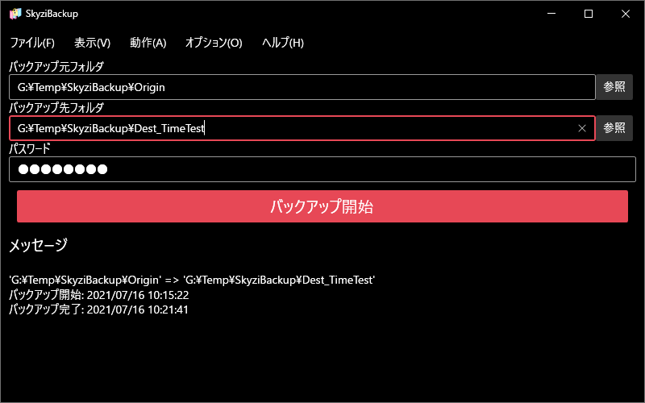
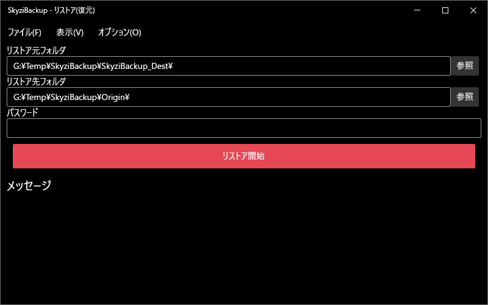

  
*Windowsテーマに合わせたGUI*

  
*リストアウィンドウ*

.png)  
*MITライセンス*

  
*使用ライブラリの情報*

  
*データ保存先を変更可能(高速なドライブを推奨)*

  
*ミラーリングやバージョン管理等の設定が可能*

  
*柔軟かつ簡単な除外パターン設定*

  
*ファイルの比較方法は複数選択*

  
*暗号化パスワードを暗号化して保存*

  
*圧縮アルゴリズムも選択可(おすすめはデフォルトのDeflate)*

  
*リパースポイントの取り扱い方も選択可能*
