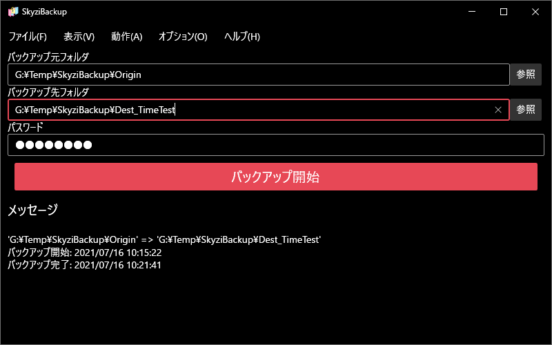
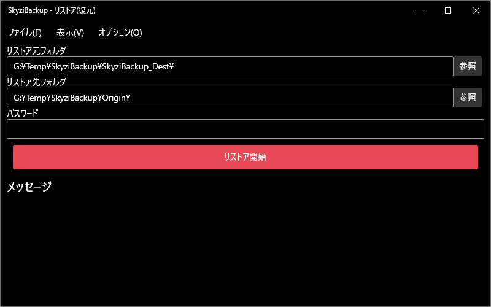

SkyziBackupの各機能と画面を画像でご紹介します。直感的で使いやすいインターフェースをご確認ください。

## メイン画面

  

    <h3 class="content-card-title">メインウィンドウ</h3>
    
バックアップ操作の中心となる画面

  

  
  
Windowsテーマに合わせた直感的なGUIで、初心者でも簡単にバックアップ操作を行えます。

  

    <a href="./manual" class="btn btn-primary btn-sm">使い方を見る</a>
    <a href="#backup-settings" class="btn btn-ghost btn-sm">設定詳細</a>
  

## 復元機能

  

    <h3 class="content-card-title">リストアウィンドウ</h3>
    
バックアップファイルの復元画面

  

  
  
バックアップしたファイルを元の場所や任意の場所に簡単に復元できます。

## ライセンス情報

  

    

      <h3 class="content-card-title">MITライセンス</h3>
    

    
    
オープンソースソフトウェアとして、MITライセンスの下で公開されています。

  

  

    

      <h3 class="content-card-title">サードパーティライセンス</h3>
    

    
    
使用ライブラリの詳細なライセンス情報を表示します。

  

## 設定画面 {#backup-settings}

  

    

      <h3 class="content-card-title">基本設定</h3>
    

    
    
<strong>データ保存先設定</strong> 高速なドライブを選択してパフォーマンスを最適化できます。

  

  

    

      <h3 class="content-card-title">バックアップ設定</h3>
    

    
    
<strong>ミラーリング・バージョン管理</strong> 用途に応じて柔軟な設定が可能です。

  

  

    

      <h3 class="content-card-title">除外設定</h3>
    

    
    
<strong>除外パターン</strong> 不要なファイルを柔軟かつ簡単に除外できます。

  

## 高度な設定

  

    

      <h3 class="content-card-title">ファイル比較設定</h3>
    

    
    
<strong>比較方法の選択</strong> ファイルサイズ、更新日時、ハッシュ値など、複数の比較方法から選択可能です。

  

  

    

      <h3 class="content-card-title">暗号化設定</h3>
    

    
    
<strong>AES256暗号化</strong> 暗号化パスワードを安全に保存し、強力な暗号化でデータを保護します。

  

  

    

      <h3 class="content-card-title">圧縮設定</h3>
    

    
    
<strong>圧縮アルゴリズム</strong> Deflate（推奨）をはじめ、複数の圧縮方式から選択できます。

  

## 上級者向け機能

  

    <h3 class="content-card-title">リパースポイント設定</h3>
    
シンボリックリンク・ジャンクションの取り扱い

  

  
  
システムリンクやジャンクションの取り扱い方を細かく設定できる上級者向け機能です。Windows特有のファイルシステム機能に対応しています。

  

    <a href="./manual#advanced" class="btn btn-secondary btn-sm">詳細マニュアル</a>
    <a href="./faq" class="btn btn-text btn-sm">よくある質問</a>
  

## 次のステップ

  

    
📖

    <h3 class="feature-title">使い方を学ぶ</h3>
    
詳細なマニュアルで基本操作から応用機能まで学習できます。

    <a href="./manual" class="feature-link">
      マニュアルを見る
      <svg width="16" height="16" viewBox="0 0 16 16" fill="currentColor">
        <path d="M4.646 1.646a.5.5 0 0 1 .708 0l6 6a.5.5 0 0 1 0 .708l-6 6a.5.5 0 0 1-.708-.708L10.293 8 4.646 2.354a.5.5 0 0 1 0-.708z"/>
      </svg>
    </a>
  

  

    
💬

    <h3 class="feature-title">サポートを受ける</h3>
    
よくある質問の確認や、お問い合わせができます。

    <a href="./faq" class="feature-link">
      FAQ・サポート
      <svg width="16" height="16" viewBox="0 0 16 16" fill="currentColor">
        <path d="M4.646 1.646a.5.5 0 0 1 .708 0l6 6a.5.5 0 0 1 0 .708l-6 6a.5.5 0 0 1-.708-.708L10.293 8 4.646 2.354a.5.5 0 0 1 0-.708z"/>
      </svg>
    </a>
  

